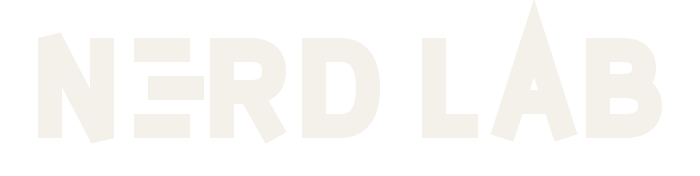
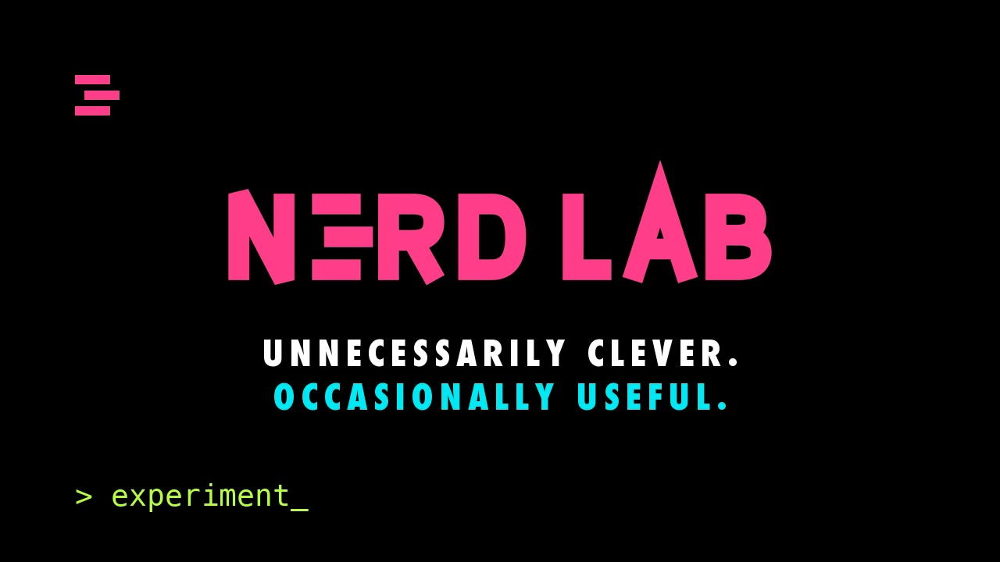

<picture>
  <source media="(prefers-color-scheme: dark)" srcset="assets/nerd-lab-offwhite.svg">
  <source media="(prefers-color-scheme: light)" srcset="assets/nerd-lab-ink.svg">
  
</picture>

**Unnecessarily clever. Occasionally useful.**

Nerd Lab is an open, experimental playground for people who like to explore technology
in unconventional ways — a place for knowledge creation, awareness building, and showing
colleagues what these tools actually do on a normal working day. It is not a company, not
a course, and not a corporate AI initiative; it is a group of true nerds in the making,
and the entrance requirement is curiosity.

<!--
  BRAND VIDEO
  Replace the 
 block below with the bare github.com/user-attachments/assets/… URL
  that GitHub gives you after dragging assets/nerd-lab-intro.mp4 into a comment box.
  A bare URL on its own line renders as an inline player. A repo-relative path does not.
-->

  
   
  28 seconds. Plays on the <a href="https://nerd-factory.github.io/nerd-lab/">site</a>.

---

## Why Nerd Lab exists

**Learn by building.** Nothing here starts with a curriculum. We take a problem that is
mildly infuriating, overengineer a solution to it, and work out what we learned on the
way back out.

**Make new tech approachable for the curious.** AI agents, RAG, automation, data, web and
app building — most of it stops being intimidating the moment you watch someone else do it
badly first. We do that part in public, on purpose.

**Open source everything.** Every experiment, including the ones that did not work.
Especially those — the failure is usually the interesting half.

---

## Current experiments

| Experiment | What it does | Status |
|---|---|---|
| **[UNAIVERSE](https://mafiatun.github.io/unaiverse)** | An interactive galaxy-style explorer of the UN's journey with AI. Every link in it is official. The orbital mechanics are editorial. | live |
| `experiment-002` | Sealed until it stops disagreeing with itself. | in the lab |
| `experiment-003` | Currently a diagram on a napkin. The napkin is winning. | in the lab |

---

## Join the lab

You do not need an AI background. You do not need a data background. You do not need a
technical background at all. If you are the kind of person who opens the settings menu
just to see what is in there, you are already qualified.

Everything we build is open source. People who keep showing up become co-maintainers —
not as a reward, just as an accurate description of what has already happened.

Two doors, both unlocked:

- **[Discussions](https://github.com/nerd-factory/nerd-lab/discussions)** — ask the question
  you think is too basic. It is not. This is the best place to start if you have never
  used GitHub before.
- **[Issues](https://github.com/nerd-factory)** — pick something up, or report that
  something is broken. Reporting counts as contributing.

Neither door asks what you do for a living.

---

Unnecessarily clever solutions to unnecessarily annoying problems. 
Built in public, broken in public, documented either way.

